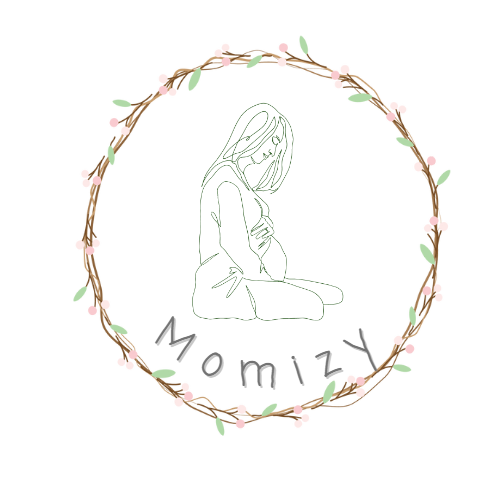

# redme

# Momizy

[See the App](https://momizy-app.netlify.app/)



### Descripción

Esta página web está enfocada en las mujeres embarazadas, para que todas ellas tengan un lugar sencillo de utilizar para poder organizar la llegada del más pequeño de la casa.

## Funcionalidades a implementar

- Añadir una APi para algo en las preguntas.
- Añadir likes en los comentarios.

### Tecnologías utilizadas

- JavaScript
- Express
- MongoDB
- Mongoose
- NodeJS

## Estructura del Server

### Modelos

User model:

```jsx
User {
username: { type: String, required: true},
email: { type: String, required: true},
password: { type: String, required: true},
image: String,
weekDays: String,
babyName: String}
```

Diario model:

```jsx
Diario {
date: { type: Date, required: true},
title: { type: String, required: true},
description: { type: String, required: true},
score: { type: Number, default: 0},
emoji: { type: String, enum: ["diferentes emoticonos"], required: true},
user: { type: Schema.Types.ObjectId, required: true, ref: "User"}
	}
```

Lista model: 

```jsx
Lista {
title: { type: String, required: true},
items: [{ type: String, required: true}],
user: { type: Schema.Types.ObjectId, required: true, ref: "User"}
}
```

Question model:

```jsx
Question {
title: { type: String, required: true},
description: { type: String, required: true},
kind: { type: String, enum: ["Síntoma", "Puedo comerlo?", etc], required: true}
user: { type: Schema.Types.ObjectId, required: true, ref: "User"},
}
```

Answer model: 

```jsx
Answer {
description: { type: String, required: true},
user: { type: Schema.Types.ObjectId, required: true, ref: "User"},
question: { type: Schema.Types.ObjectId, required: true, ref: "Question"},
}
```

## **API Endpoints (backend routes)**

| METHOD | ENDPOINT | Success status | Error Status | BODY | DESCRIPTION |
| --- | --- | --- | --- | --- | --- |
|  POST | /signup | 201 | 401 | username, email, password | registra un usuario |
| POST | /login | 200 | 400 | username, password | inicia sesión un usuario y genera el token |
| PUT | /user/:username | 200 | 400 | image, weekDays, babyName | Actualiza los datos de un usuario |
| GET | /user/:username | 200 | 400 | n/a | Obtiene los datos de un usuario |
| GET | /verify | 200 | 400 | n/a | Informa al frontend si el usuario está registrado |
| GET | /questions | 200 | 400 | n/a | obtiene todas las preguntas |
| GET | /questions/filter/:filter | 200 | 400 | n/a | obtiene las preguntas que cumplen con el filtro. Por tipo |
| GET  | /questions/:id | 200 | 400 | n/a | obtiene la pregunta y las respuestas asociadas a la pregunta |
| POST | /questions/:username | 200 | 400 | title, description, kind | registra una nueva pregunta |
|  GET  | /questions/:id/answer | 200 | 400 | description | registra una nueva respuesta asociada a una pregunta |
|  GET | /list/all/:email | 200 | 400 | n/a | Obtiene las listas de un usuario |
|  POST | /list/:email | 201 | 400, 401 | title, items | Crea una nueva lista |
|  GET | /list/:id | 200 | 400 | n/a | Obtiene una lista de un usuario |
|  PUT | /list/:id | 200 | 400 | title, items | Actualiza una lista |
| DELETE | /list/:id | 200 | 400 | n/a | Borra una lista por id |
|  GET | /diario/:email | 200 | 400 | n/a | Obtiene las entradas del diario de un usuario |
|  POST | /diario/:email | 201 | 400, 401 | date, title, description, score, emoji | Crea una entrada en el diario de un usuario |
|  GET | /diario/:email/:id | 200 | 400 | n/a | Obtiene una entrada del diario de un usuario |

### Project

[Link del repositorio del Cliente](https://github.com/Proyecto-final-Ironhack-Lorena/app-client)

[Link del repositorio del Server](https://github.com/Proyecto-final-Ironhack-Lorena/app-server)

[Link del Deploy](https://momizy-app.netlify.app/)

### Slides

[Link a los Slides](https://www.canva.com/design/DAFlUuGxEyo/4QYe3ho-XVWaPPU9lNO33w/view?utm_content=DAFlUuGxEyo&utm_campaign=designshare&utm_medium=link&utm_source=publishsharelink)